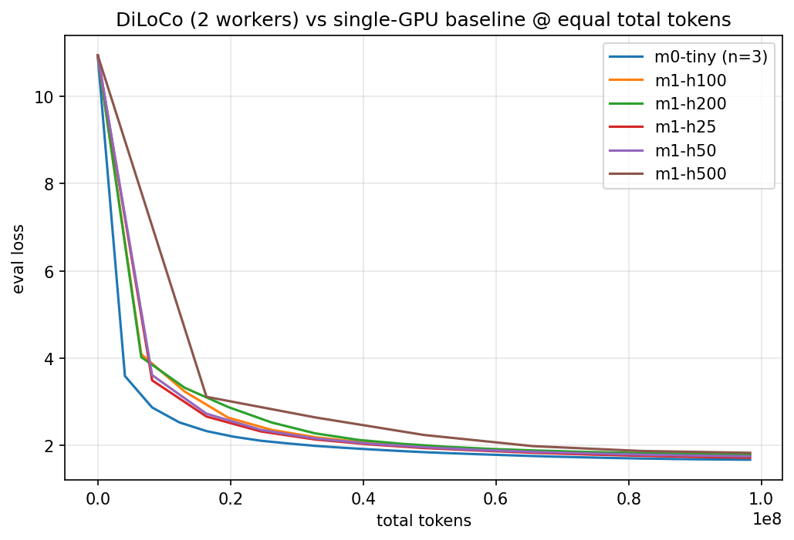
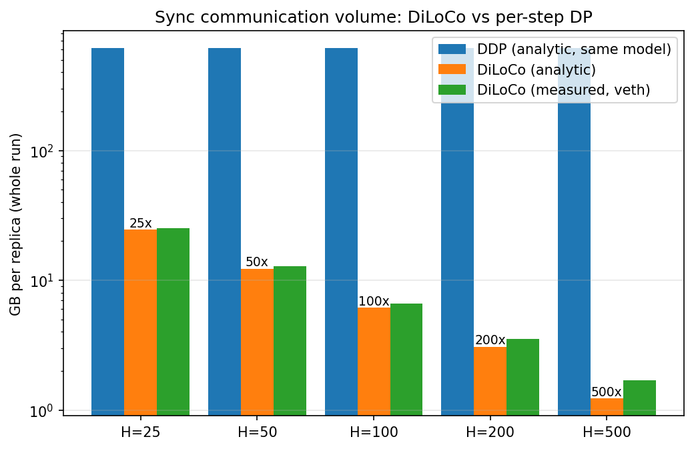

# ft-diloco

**Fault-tolerant DiLoCo: resilient low-bandwidth LLM training on commodity hardware.**

Train a small LM across cheap, unreliable machines that sync only every H steps
(DiLoCo: inner AdamW, outer Nesterov SGD over pseudo-gradients, via
[torchft](https://github.com/meta-pytorch/torchft)) — and show that killing,
disconnecting, or adding machines mid-run does not break convergence.

> Status: M0 + M0.5 + M1 complete. Money-shot chaos demo (M2) next. Full polish at M5.

## Results so far

**Fault tolerance works (M0.5):** `kill -9` a worker mid-training and the survivor keeps
committing without a stall; relaunch it and torchft's P2P recovery restores model params
**and outer Nesterov momentum bit-exactly** (30/30 sha256 digest matches at every
post-rejoin sync boundary). Details: [docs/findings-171.md](docs/findings-171.md).

**DiLoCo trades sync frequency for quality smoothly (M1):** 2 workers, 51M params,
TinyStories, equal total tokens vs a 3-seed single-GPU baseline (eval loss 1.6773 ± 0.0011):

| sync every H steps | 25 | 50 | 100 | 200 | 500 |
|---|---|---|---|---|---|
| eval loss | 1.724 | 1.756 | 1.783 | 1.801 | 1.836 |
| Δ loss vs baseline | +2.8% | +4.7% | +6.3% | +7.4% | +9.4% |
| comm volume vs per-step DP | 25× less | 50× | 100× | 200× | 500× |

Measured wire bytes (veth counters) match the analytic payload within +2…8% for H ≤ 100;
the residual is a ~constant ~0.5 GB/run control-plane floor (lighthouse heartbeats +
quorum), which dominates only when payload shrinks at H = 500. Single seed per H so far;
outer lr fixed at 0.7 across H (untuned — known to favor small H).




## Layout

- `src/ftdiloco/` — model (nanoGPT-class), data (uint16 memmap shards), train loop,
  torchft integration (`train.py` + `ft.py` are the only torchft touchpoints), JSONL metrics
- `chaos/` — fault-injection controller (kill / partition / throttle / late-join)
- `scripts/` — lighthouse/worker launchers, netns fake-WAN, run recipes
- `analysis/` — log fusion + plots
- `configs/` — model / train / chaos / netem YAML
- `experiments/<run_id>/` — committed JSONL + plots per run
- `docs/` — architecture, runbook, torchft findings (issue #171 evidence)

## Quickstart (dev)

```bash
uv venv && uv pip install -e '.[dev]'
make lint test
# data prep + training run on the GPU host:
python -m ftdiloco.data --dataset tinystories --out data/tinystories
python -m ftdiloco.train --config configs/train/m0_tiny.yaml
python analysis/plot_convergence.py --runs experiments/m0-tiny-* --out plots/m0.png
```

## Hardware

| Node | Role | Spec |
|---|---|---|
| worker4 | GPU trainer | Ryzen 9 5950X, RTX 3060 12GB, Gen4 NVMe |
| worker1 | Lighthouse / CPU worker | 8-core, 16GB |
| link | deliberately commodity | gigabit ethernet + tc/netem WAN simulation |

torchft is installed editable from a pinned fork checkout on the training hosts
(commit recorded in `pyproject.toml`); it is not a pip dependency of this package.
